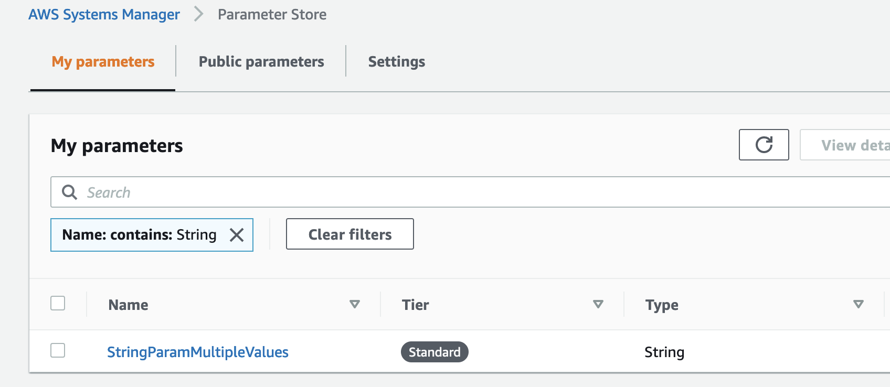
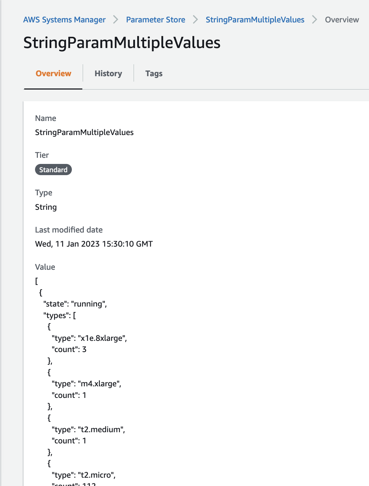

# How to create a SSM parameter with multiple values


## Introduction

AWS Systems Manager Parameter Store is a vital service for storing and managing configuration data for your applications. However, not many people know that it also allows you to store multiple values within a single parameter. This feature can be extremely beneficial when you have multiple related values that need to be stored together, such as a group of database connection strings. AWS Cloud Development Kit (CDK) is a powerful tool for creating and managing AWS infrastructure using code, and it makes it easy to automate the process of creating and storing multiple values within a single parameter in Systems Manager Parameter Store. In this blog post, we will show you how to use the CDK to create, manage and store these multiple values within a single parameter in the Parameter Store and demonstrate how to use the AWS SDK for Python (boto3) to read and access them in your application. We will also explain the benefits of using this approach, its potential advantages and how it can simplify the management of your configurations. By the end of this post, you will have a better understanding of how to use this little-known feature in the Parameter Store effectively with CDK.

The AWS documentation states that Parameter Store, a capability of AWS Systems Manager, provides secure, hierarchical storage for configuration data management and secrets management. You can store data such as passwords, database strings, Amazon Machine Image (AMI) IDs, and license codes as parameter values. You can store values as plain text or encrypted data. You can reference Systems Manager parameters in your scripts, commands, SSM documents, and configuration and automation workflows by using the unique name that you specified when you created the parameter.

Currently, Parameter Store supports three types of parameters: `String`, `StringList` and `SecureString`. The `String` parameter allows you to save values such as “2023” or “This is a sample string”. Meanwhile, with `StringList` you can save comma separated values such as [“New York”, “Florida”, “California”]. If you need to save sensitive data such as passwords, then always use `SecureStrings`.


## Creating and saving multiple values in a single *string* Parameter


In this blog post we will concentrate on the `String` parameter and see how we can save multiple JSON objects within a single string by serializing the objects. It's worth mentioning that `StringList` doesn't support complex objects such as multiple JSON objects.

Let assume we have a pair of sample objects as follow:


```
ec2_in_running_state = {
            "state": "running",
            "types": [
            {
                "type": "x1e.8xlarge",
                "count": 3
            },
            {
                "type": "m4.xlarge",
                "count": 1
            },
            {
                "type": "t2.medium",
                "count": 1
            },
            {
                "type": "t2.micro",
                "count": 112
            }
        ]}

        ec2_in_stopped_state = {
            "state": "stopped",
            "types": [
            {
                "type": "m4.large",
                "count": 1
            }
            ]
        }
```

 
Here we have two JSON objects containing a list of instances by instance type and their state, either running or stopped. 

If we try to save one or both these objects as a `String` parameter we would get an error, because as explained before the parameter must be a single string. Let's look now how to go about this using the AWS CDK (without going into details into how to set up a CDK project, or what the AWS CDK is).

We import the needed modules:


```
from aws_cdk import (
    # Duration,
    Stack,
    aws_ssm as ssm
)

import json
```


The next thing we need to do is to put these two objects in a Python and then serialize the List to create a serialized List of objects.


```
parameters_serialized_list = json.dumps([ec2_in_running_state, ec2_in_stopped_state], indent=2)
```

Now that we the objects serialized, the next step is to create the SSM parameter:


```
new_ssm_parameter = ssm.StringParameter(
            self,
            "ssm-string-parameter-with-multiple-values",
            description="Saving JSON objects as string list parameters in SSM via AWS CDK",
            parameter_name="StringParamMultipleValues",
            string_value=parameters_serialized_list
        )
```


As you can see we set up the `string_value` to the serialized object. If we now deploy the CDK stack and go to the AWS Systems Manager console we can see our newly created Parameter.


Click on the Parameter name go to the overview page:


Under *Value* you can find the *List* of objects, that contains to objects we saved. 


## Reading the values from our *string* Parameter using *boto3*


Now that we have our values saved in Parameter Store, let's retrieve them from a sample Python application. Here's the sample code for the application:


```
"""
Small script to get multiple values serialized into a SSM Parameter value
"""
import boto3
import json
# Create a ssm boto3 client to interact with the SSM API
client = boto3.client('ssm')

response = client.get_parameter(
    Name="StringParamMultipleValues",
    WithDecryption=True
)
# The SSM response is an object and we need access the value as such
# Then we deserialize it to a list of dictionaries
resposne_values =  json.loads(response["Parameter"]["Value"])
# Print the list of dictionaries
print(resposne_values)
```

Here are the steps the script takes:


* Import the required modules: boto3 and json
* Create a SSM client 
* Call the get_parameter API and save the response in a variable with the same name.
* De-serialize the string into a Python JSON object so we can navigate and manipulate the information.
* Finally, we print the values in list (array) of dictionaries (objects).

Here's the result of the code above:

```
[{'state': 'running', 'types': [{'type': 'x1e.8xlarge', 'count': 3}, {'type': 'm4.xlarge', 'count': 1}, {'type': 't2.medium', 'count': 1}, {'type': 't2.micro', 'count': 112}]}, 
{'state': 'stopped', 'types': [{'type': 'm4.large', 'count': 1}]}]
```

If you check the type, you'll see it's a *List* of dictionaries:

```
print(type(resposne_values))
```

Result:

```
<class 'list'>
```


## Conclusion

In this blog we walked through the process of storing multiple values within a single parameter in AWS Systems Manager Parameter Sore using the AWS CDK. If you have a complex set of values that you need to read to perform an action is better to manage them under a single parameter than have each individual value saved a separate parameter. It reduces the complexity of having to create, read and update multiple parameters and streamlines automation tasks.
