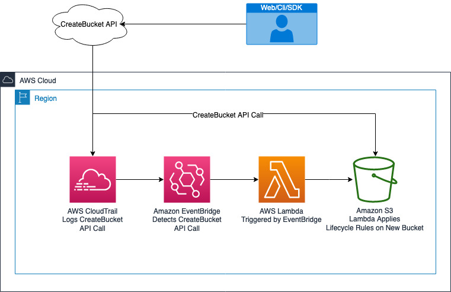

# 

# Automating the creation of S3 Incomplete Multipart Upload Lifecycle Rules to Optimize Cost Using an Event-driven Architecture


This post expands on the previous [post](https://github.com/jmroche/cloudops/tree/main/aws-scripts/s3-incomplete-mpu) were I discussed how apply multipart upload (MPU) lifecycle rules to delete lingering parts of failed uploads that do consume space and cost you money. In that post we looked at how we can use AWS SDK for Python (boto3) to scan for all buckets in an account, check if each bucket has an MPU lifecycle policy rule in place, and if no rules exist, then create one. This approach automates the process that would be extremely tedious to do by hand on the AWS console otherwise. 

What if we could respond to events happening in our accounts and take a specific action? An event-driven architecture, as AWS explains it [here](https://aws.amazon.com/event-driven-architecture/), is an architecture that uses events to trigger and communicate between decoupled services. An event is a change in state, or an update, like an item being placed in a shopping cart on an e-commerce website. 

If we take the idea of an event-driven architecture, as explained above, and apply it to our process of applying MPU lifecycle rules to buckets in our account. Then, instead of scanning our accounts to get all buckets then check and apply the MPU lifecycle rules bucket by bucket, we could just listen to events of a new bucket being created and trigger the application of the MPU lifecycle rules. This would take our automation level, and organization's compliance for example, up a notch. Every single bucket that's is created will be checked for MPU lifecycle rules and one be applied if none found without any human intervention.

The architecture looks like this:





Once a user or piece of software in our organization [creates a new S3 bucket](https://docs.aws.amazon.com/AmazonS3/latest/API/API_CreateBucket.html), either through the console, using the AWS CLI or the AWS SDK (everything in AWS is an API call), that call will be recorded by AWS [CloudTrail](https://docs.aws.amazon.com/awscloudtrail/latest/APIReference/Welcome.html). CloudTrail, as many other services in AWS generate [events](https://docs.aws.amazon.com/eventbridge/latest/userguide/eb-events.html) that [EventBridge](https://aws.amazon.com/eventbridge/) receives.  EventBridge is a serverless event bus that can receive events from many sources, from AWS services and external third-party sources, filter them, and apply routing logic to route the event to a target; an AWS [Lambda](https://aws.amazon.com/lambda/) function in our case. The AWS Lambda function will receive the event and run the logic specified in its handler. This logic is the same logic, with some minor tweaks, that we discussed in the previous [post](https://github.com/jmroche/cloudops/tree/main/aws-scripts/s3-incomplete-mpu).

We can happily jump onto the AWS console and click all over the place to stitch this solution together. We want to follow [DevOps](https://aws.amazon.com/devops/what-is-devops/) good practices and develop this infrastructure as code (IaC). Therefore, I'll use the AWS [CDK](https://aws.amazon.com/cdk/) instead of [ClickOps](https://www.lastweekinaws.com/blog/clickops/) to deploy the infrastructure and our application's logic to the AWS Lambda function.

To deploy the project:

```
`$ python3 -m venv .venv`
```

After the init process completes and the virtualenv is created, you can use the following step to activate your virtualenv.

```
`$ source .venv/bin/activate`
```

If you are a Windows platform, you would activate the virtualenv like this:

```
`% .venv\Scripts\activate.bat`
```

Once the virtualenv is activated, you can install the required dependencies.

```
`$ pip install -r requirements.txt`
```

At this point you can now synthesize the CloudFormation template for this code.

```
`$ cdk synth
`
```

Finally, run:

```
$ cdk deploy
```

