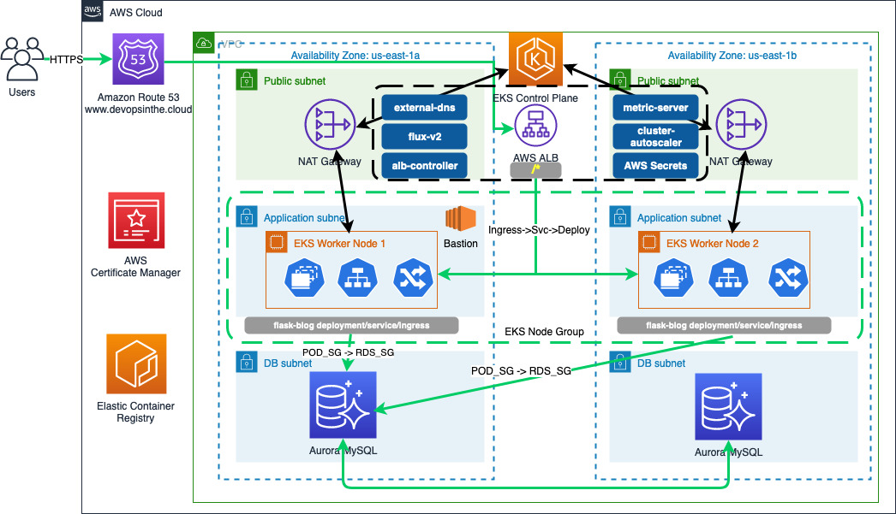

# DevOps in the Cloud

Personal blog where I experiment and document with different cloud technologies and stacks.

###
It's a work in progress, and here's what I'm working on and what I have working so far:

* Blog MVP: The initial minimum viable product for the blog application. This is written in Python using Bootstrap and Flask.
* The blog code is stored in Github where the code is unit tested on Pull Request (PRs), and Merge
* Dependabot checks daily for dependency updates and creates PRs to merge new versions
* The blog application is containerized and image stored in AWS Elastic Container Registry (ECR) initially. The image is built via an automated pipeline using GitHub Actions on pushes to the main branch on specific paths.
* The blog is deployed to Kubernetes in AWS EKS
    * Kubernetes has the following components:
        * ALB Controller
        * Metric Server
        * Cluster auto-scaler
        * Flux-v2 for GitOps
        * External-dns
        * AWS Secrets CNI
    * The application is deployed to two (2) different namespaces. Deployment, Services and Ingress are defined in yaml, and can be found in the `/k8s` directory
* The datastore for the blog is AWS Aurora MySQL
* The blog is deployed to AWS and the architecture includes:
    * VPC with three (3) AZ and subnets for Public, Application with NAT and Isolated for DB clusters
    * Aurora MySQL Clusters for both test and production environments
    * NAT GW to handle all the communication to the internet, as none of the services are internet reachable
    * Application Load Balancer (ALB) with an alias to the domains for the test and production services
    * Route 53 with public hosted zone
    * AWS Certificate Manager linked to the public hosted zone and ALB
    * AWS Secrets to hold different secrets such as dynamically created DB passwords and GitHub tokens
    * AWS Parameter store to store dynamically created configurations such as DB endpoints, ECR repositories
    * AWS Elastic Container Registry to stored docker images
    * Bastion host in the Application subnets, reachable only using SSM with connections to the Kubernetes cluster dynamically configured on creation with additional Kubernetes management application needed: Helm and Flux
* The entire Infrastructure as Code is created using the AWS CDK and the different stacks can be found in `/infra/stacks`
* Currently there are two different pipelines built using GitHub Actions:
    * On PRs the code will be linted and Python tests will be run to ensure there are no errors introduced to the application.
    * On commits to the main branch the docker image will be built, tagged and pushed to the AWS Elastic Container Registry (ECR)
    * On commit Amazon CodeGuru will perform a code review to ensure no security issues are introduced and/or provide suggestions to make the code more effiicient.
    * On push to ECR, ECR will scan the images for vulnerabilities and alert of any vulnerabilities found

### Still work in progress:

* Flux GitOps Deployment Pipeline
* Infrastructure Deployment Pipeline

### Here's a high level architecture diagram:

